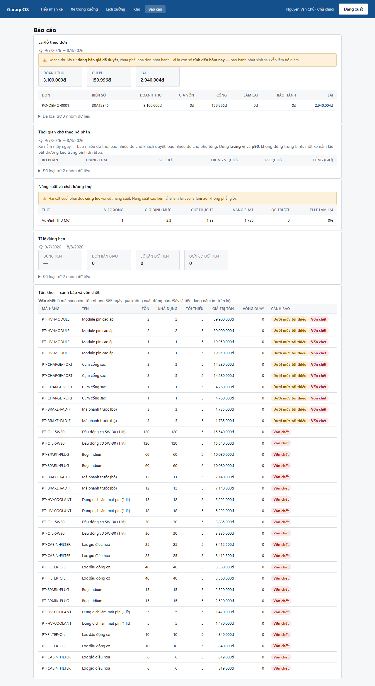
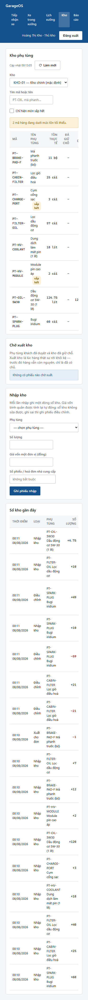
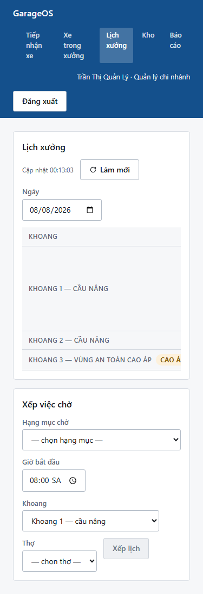
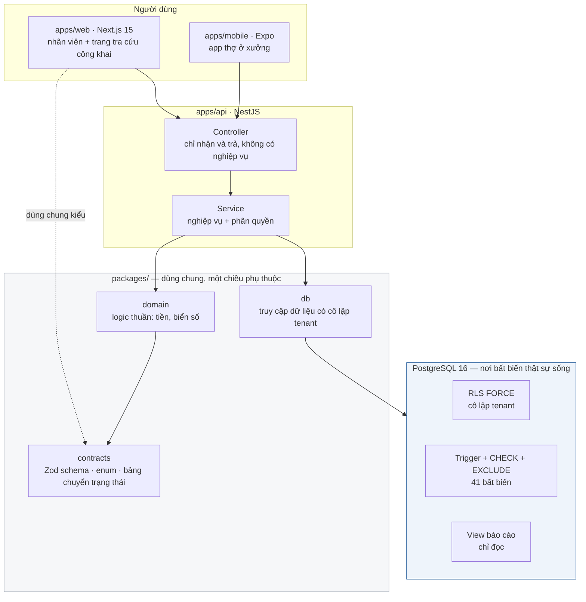

# GarageOS

Hệ thống quản lý xưởng dịch vụ ô tô đa chi nhánh, hỗ trợ xe xăng / hybrid / điện.

**NestJS · Next.js 15 · PostgreSQL 16 · TypeScript · monorepo pnpm + Turborepo**

[](https://github.com/khanhviet529/GarageOS/actions/workflows/ci.yml)

---

> 👋 **Mới tham gia dự án?** Đọc [`ONBOARDING.md`](ONBOARDING.md) trước — nó
> gom lại: dự án làm gì, chạy lên thế nào, quy tắc nào không được vi phạm, và
> toàn bộ danh sách việc còn phải làm.

## Dự án này giải quyết gì

Một garage ô tô nhận xe, chẩn đoán, báo giá, sửa, rồi giao xe. Nghe đơn giản,
nhưng phần lớn phần mềm quản lý garage ở Việt Nam làm sai đúng những chỗ khó:

| Tình huống có thật | Phần mềm ngây thơ làm sai thế nào |
|---|---|
| Khách nói *"phanh với đèn thì làm đi, điều hoà để lần sau"* | Trạng thái duyệt đặt ở cấp báo giá → phải lập báo giá mới → chậm, gõ lại giá dễ sai, và **mất dữ liệu** về việc khách đã từ chối gì để lần sau chào lại |
| Nhân viên gõ `30A-123.45`, lần sau gõ `30A12345` | Một chiếc xe có hai hồ sơ → lịch sử phân mảnh → tra bảo hành không ra |
| Xe thuần điện vào xưởng | Danh sách vẫn chào bán "thay dầu động cơ" → lộ ngay sự thiếu chuyên nghiệp trước mặt khách |
| Garage tăng giá công tháng sau | Báo giá đã gửi khách tuần trước đổi theo → con số khách đồng ý khác con số xưởng thu |
| Khách khiếu nại vết trầy không do xưởng gây ra | Không có ảnh hiện trạng → garage thường thua |

GarageOS coi những tình huống đó là **bài toán trung tâm**, không phải ngoại lệ.
Toàn bộ thiết kế nằm ở [`docs/`](docs/README.md) — 9.300 dòng, viết trước khi
viết dòng code đầu tiên.

---

## Demo: một vòng đầu-cuối

Kịch bản dưới đây **chạy thật** trong CI mỗi lần push, bằng một test Playwright
điều khiển hai trình duyệt song song — máy tính ở quầy và điện thoại của khách
([`e2e/tra-cuu-cong-khai.spec.ts`](e2e/tra-cuu-cong-khai.spec.ts)).

### 1. Tiếp nhận xe

Gõ biển số → hệ thống chuẩn hoá và tra. Ba kết quả, ba hành động khác nhau.
Cảnh báo số km lùi hiện **ngay khi gõ**, không đợi bấm lưu — lúc đó người dùng
vẫn đang đứng cạnh đồng hồ công tơ mét.


### 2. Danh mục lọc theo loại động cơ

Cùng một màn hình, mở với xe thuần điện: **không có** "thay dầu động cơ". Hạng
mục không áp dụng được thì không xuất hiện, chứ không phải bị làm mờ.


### 3. Lập báo giá

Danh mục bên trái, báo giá đang hình thành bên phải. Cố vấn ngồi cạnh khách vừa
nói vừa thêm hạng mục, nên tổng tiền phải luôn trong tầm mắt. Phụ tùng gắn vào
hạng mục công đã dùng nó.


### 4. Khách duyệt từng phần trên điện thoại

Khách mở link, không cần cài ứng dụng, không cần tài khoản. Chọn từng hạng mục,
tổng của phần đã chọn cập nhật ngay. Xác nhận bằng mã OTP gửi về số điện thoại
trên hồ sơ khách.


Phụ tùng **nằm bên trong** hạng mục công và không có công tắc riêng — khách
không thể duyệt phụ tùng mà không duyệt công.

### 5. Máy trạng thái

Chỉ hiện những bước hợp lệ từ trạng thái hiện tại. Nút không hợp lệ không xuất
hiện — làm mờ vẫn buộc người dùng đọc và loại trừ.


### 6. Báo cáo — ba chỗ cố ý không cho nhìn nửa sự thật



Ba thứ trên màn hình này là quyết định thiết kế, không phải bố cục ngẫu nhiên:

| Thấy gì | Vì sao đặt như vậy |
|---|---|
| Năng suất và tỉ lệ làm lại **cùng một bảng** | Năng suất cao + rework cao = làm ẩu, không phải giỏi. Tách hai bảng là mời người xem khen nhầm người |
| Tỉ lệ đúng hẹn đứng cạnh **số lần dời hẹn**, cùng cỡ chữ | 95% đúng hẹn mà mỗi đơn dời hẹn ba lần thì con số 95% vô nghĩa |
| Ô "chưa đủ dữ liệu" là **dấu gạch**, không phải số 0 | Năng suất `null` nghĩa là giờ bấm quá ít để tính. Hiện 0 là vu oan cho một người bằng một lỗi hiển thị |

Mỗi khối nói rõ **kỳ** nó tính và **đã loại trừ gì** — một báo cáo lặng lẽ bỏ
bớt dữ liệu là báo cáo nói dối, kể cả khi việc bỏ bớt là đúng.

### 7. Màn hình co được xuống điện thoại

Thủ kho đứng giữa kệ hàng và quản lý đi quanh xưởng đều dùng điện thoại. Bảng
không co lại thành thẻ — nó **cuộn ngang trong khung riêng**, để cột đầu tiên
vẫn là mã hàng chứ không phải một nhãn lặp lại ở mọi thẻ.

<p>
  
  
</p>

---

## Điều gì đáng xem về mặt kỹ thuật

### Bất biến enforce ở tầng thấp nhất có thể

41 bất biến được liệt kê ở [`docs/05-invariants.md`](docs/05-invariants.md), và
nguyên tắc là **ràng buộc DB > trigger > service > UI**. UI không bao giờ tính
là enforce.

```sql
-- 🔒 INV-V-03: một xe chỉ có MỘT đơn đang mở
CREATE UNIQUE INDEX one_open_order_per_vehicle
  ON repair_order (tenant_id, vehicle_id)
  WHERE status NOT IN ('DELIVERED','CANCELLED');
```

```sql
-- 🔒 INV-V-01: hạng mục phải hợp loại động cơ — TẦNG BẢO VỆ THẬT.
-- Giao diện chỉ giấu hạng mục khỏi danh sách; trigger này chặn hẳn, dù request
-- đến từ API, script bảo trì hay import.
CREATE TRIGGER trg_qline_powertrain
  BEFORE INSERT OR UPDATE OF service_item_id ON quotation_line
  FOR EACH ROW EXECUTE FUNCTION kiem_tra_powertrain_dong_bao_gia();
```

### Cô lập tenant bằng Row-Level Security, không bằng `WHERE`

```ts
// 🔒 tenantId đến từ token đã xác thực, không bao giờ từ tham số request
await client.query('SELECT set_config($1, $2, true)', ['app.tenant_id', actor.tenantId]);
```

⚠️ **Cái bẫy tốn nhiều thời gian nhất của dự án:** superuser và role có
`BYPASSRLS` **bỏ qua RLS kể cả khi** bảng đã `FORCE ROW LEVEL SECURITY`. Cô lập
trông như hoạt động cho tới lúc không. Dự án tách hai role — `garageos` chạy
migration, `garageos_app` chạy ứng dụng — và **API từ chối khởi động** nếu role
kết nối có đặc quyền.

### Tiền là số nguyên đồng, làm tròn ở từng dòng

Database tính tiền của một dòng bằng trigger; TypeScript có bản song song để xem
trước trên giao diện. Có **test đối chiếu hai bên khớp từng đồng** trên 7 tổ hợp
số lượng lẻ và thuế suất — cùng loại rủi ro "một quy tắc, hai bản cài đặt" như
`normalize_plate`.

### Máy trạng thái ba lớp

| Lớp | Việc của nó |
|---|---|
| [`packages/contracts`](packages/contracts/src/state-machine.ts) | Web chỉ vẽ nút hợp lệ |
| Service | Thông báo lỗi tiếng Việt + khoá lạc quan qua `version` |
| Trigger database | Chặn cả script bảo trì và import |

Bảng chuyển đổi tồn tại ở hai nơi (TypeScript và một bảng dữ liệu trong DB) nên
có **test đối chiếu hai chiều**: lệch nhau nghĩa là web vẽ ra nút database từ
chối, hoặc tệ hơn — database cho qua một đường web không bao giờ hiển thị nên
không ai từng thử.

### Vòng review đối kháng

Mọi thay đổi chạm kho / tiền / quyền / bất biến phải qua `/codex-review`: tôi
code, một mô hình khác review độc lập, hai bên phản biện, và **trọng tài là một
test chạy được** chứ không phải sự đồng thuận.

6 vòng đã chạy, **17 phát hiện, 17 xác nhận đúng**. Mỗi vòng có bản ghi trong
[`docs/reviews/`](docs/reviews/README.md) nêu rõ test nào đỏ trước khi sửa —
kể cả những phát hiện chỉ ra lỗi của chính tôi:

> Phạm vi chi nhánh chỉ chặn lúc **ghi**, không chặn lúc **đọc**. Tôi đã tự viết
> kiểm tra ở `create()` và còn ghi comment *"RLS không chặn được vì cùng tenant"*,
> rồi quên áp đúng lập luận đó cho đường đọc.

---

## Kiến trúc



🔒 **Mũi tên vào PostgreSQL là mũi tên quan trọng nhất.** Bất biến không nằm ở
service — service chỉ dịch lỗi database thành câu tiếng Việt. Một script bảo
trì, một lần import, hay một service viết vội đều đi qua cùng những ràng buộc
đó.

```
apps/api        NestJS   — controller → service (nghiệp vụ + quyền) → repository → DB
apps/web        Next.js  — nhân viên + trang tra cứu công khai cho khách
apps/mobile     Expo     — app thợ: job card, bấm giờ, báo phát sinh
packages/contracts  Zod schema, type, enum, bảng hằng (state machine)
packages/domain     Logic thuần: tiền, biển số — không import framework
packages/db         Truy cập dữ liệu có cô lập tenant
infra/migrations    SQL viết tay — 🔒 nguồn sự thật của schema
docs/               Thiết kế đầy đủ, 9.300 dòng
```

🔒 **Migration là SQL viết tay, không dùng `prisma migrate`** — Prisma không tạo
được exclusion constraint, RLS policy hay trigger. Xem
[ADR-0007](docs/adr/0007-prisma-plus-raw-sql.md).

---

## Chạy tại chỗ

Cần Docker và Node 20+.

```bash
pnpm install
pnpm db:up && pnpm db:migrate && pnpm db:seed
pnpm dev            # API :3001 · web :3000
```

Mở http://localhost:3000, đăng nhập `0901000003` / `demo1234` (cố vấn dịch vụ).
Trang đăng nhập liệt kê sẵn các tài khoản demo khác.

```bash
pnpm test           # 469 test tích hợp trên Postgres THẬT — cần API đang chạy
pnpm e2e            # 69 kịch bản Playwright — cần cả API lẫn web
```

🔒 Test dùng **PostgreSQL thật trong Docker, không dùng SQLite** — exclusion
constraint và RLS không tồn tại ở đó, test sẽ xanh giả.

---

## Trạng thái

| Phase | Nội dung | Tình trạng |
|---|---|---|
| 1 | Tiếp nhận → danh mục → báo giá → khách duyệt từng phần → máy trạng thái | ✅ |
| 2 | Kho, giữ chỗ, xuất kho · phân công khoang/thợ · giờ công · QC và làm lại · báo phát sinh | ✅ |
| 3 | Hoá đơn từ công việc thực tế · thanh toán phân bổ theo dòng · công nợ · bảo hiểm | ✅ |
| 4 | App thợ (Expo) · rà soát phân quyền · thu hẹp phạm vi SELF | ✅ |
| 5 | Bảo hành · huỷ đơn và quyết toán · kiểm kê kho · xe bỏ quên | ✅ |
| 6 | Báo cáo: lãi/lỗ theo đơn, thời gian chờ, năng suất, kho, đúng hẹn | ✅ |
| 7 | Hoàn thiện để trưng bày | ✅ trừ link demo sống và video |
| 8 | Tầng công cụ cho AI agent: tool có phân quyền, guardrail, trần chi phí, nhật ký | ✅ phần không cần khoá API |

| | |
|---|---|
| Test tích hợp (Postgres thật) | 469 |
| E2E Playwright | 69 |
| Migration SQL viết tay | 49 |
| Vòng codex-review | 6 · 17 phát hiện · 17 xác nhận |

💡 **Phase 3 làm SAU Phase 5–8, có chủ ý.** Những case khó của hệ thống này
không nằm ở hoá đơn mà ở bảo hành hạn kép, huỷ đơn giữa chừng, kiểm kê kho và
xe khách bỏ lại — nên chúng được làm trước. Quyết định đó, và ba chỗ phải nối
lại khi Phase 3 xong, ghi ở [ADR-0008](docs/adr/0008-bo-qua-hoa-don-co-chu-y.md).
Cả ba đã nối, và **không chỗ nào phải viết lại** — đó là điều ADR hứa.

Chi tiết, nợ kỹ thuật đã biết và các bẫy hạ tầng đã gặp: [`STATUS.md`](STATUS.md).
Lộ trình các phase sau: [`docs/15-roadmap.md`](docs/15-roadmap.md).

---

## Bản đồ tài liệu

| Cần gì | Đọc |
|---|---|
| Vì sao làm dự án này, phạm vi tới đâu | [`00-vision.md`](docs/00-vision.md) |
| Điều gì tuyệt đối không được sai | [`05-invariants.md`](docs/05-invariants.md) |
| Trạng thái nào sang trạng thái nào | [`06-state-machines.md`](docs/06-state-machines.md) |
| Case nghiệp vụ cụ thể (15 case) | [`07-business-cases/`](docs/07-business-cases/) |
| Schema, ràng buộc, trigger | [`10-data-model.md`](docs/10-data-model.md) |
| Vì sao chọn thế này chứ không thế kia | [`adr/`](docs/adr/) |
| Nhật ký review, có dấu vết kiểm chứng | [`reviews/`](docs/reviews/README.md) |
