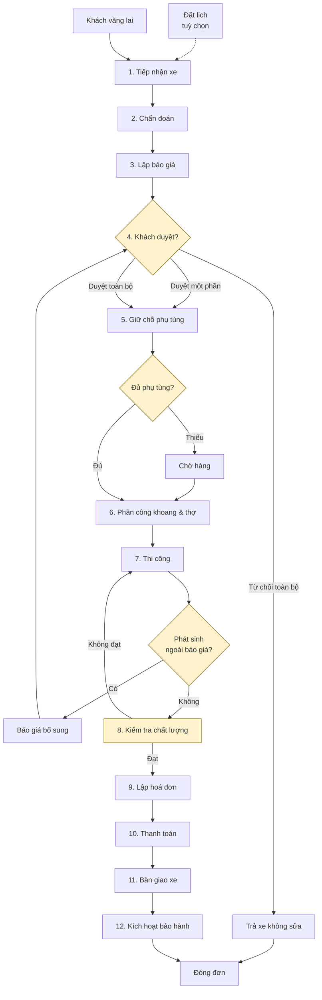

# Quy trình nghiệp vụ end-to-end

> Đọc sau: [02-actors-and-permissions.md](02-actors-and-permissions.md) · Đọc tiếp: [04-domain-model.md](04-domain-model.md)
>
> Tài liệu này mô tả **dòng chảy công việc**. Cấu trúc dữ liệu ở [04](04-domain-model.md),
> quy tắc bất biến ở [05](05-invariants.md), trạng thái ở [06](06-state-machines.md).

## 1. Bản đồ tổng quan



**Bốn điểm rẽ nhánh quan trọng** (tô vàng) là nơi phần lớn độ phức tạp nghiệp vụ
nằm ở đó. Mỗi điểm được phân tích riêng trong [07-business-cases/](07-business-cases/).

---

## 2. Giai đoạn 0 — Đặt lịch (tuỳ chọn)

| | |
|---|---|
| **Tác nhân** | Khách hàng (online) hoặc Cố vấn dịch vụ (qua điện thoại) |
| **Kích hoạt** | Khách muốn đặt trước |
| **Đầu ra** | `Appointment` — chưa phải `RepairOrder` |

💡 **Đặt lịch tách khỏi đơn sửa chữa.** Lý do: rất nhiều lịch hẹn không thành
(khách không đến), và rất nhiều xe vào không hẹn trước. Gộp hai khái niệm sẽ tạo
ra một đống `RepairOrder` rỗng.

Khi khách đến → `Appointment` được **chuyển đổi** thành `RepairOrder`, và giữ
liên kết ngược để đo tỉ lệ đến/không đến.

**Quy tắc:**
- `BR-00-1` Đặt lịch giữ chỗ **khoang**, không giữ chỗ thợ (thợ phân công sau khi biết công việc thật)
- `BR-00-2` Lịch hẹn quá 2 giờ so với giờ hẹn mà chưa check-in → tự động chuyển `NO_SHOW`, giải phóng khoang
- ⚠️ Ngưỡng 2 giờ là giả định, cần cấu hình được theo tenant

---

## 3. Giai đoạn 1 — Tiếp nhận xe (Check-in)

| | |
|---|---|
| **Tác nhân** | Cố vấn dịch vụ |
| **Kích hoạt** | Xe lăn bánh vào xưởng |
| **Đầu ra** | `RepairOrder` trạng thái `RECEIVED` |
| **Thời gian mục tiêu** | ≤ 10 phút |

### Các bước

| # | Bước | Bắt buộc | Ghi chú |
|---|---|---|---|
| 1 | Nhập/quét biển số | ✅ | Hệ thống tự tra: xe đã có hồ sơ chưa |
| 2 | Xác nhận hoặc tạo mới `Customer` + `Vehicle` | ✅ | Xem [BC-01](07-business-cases/BC-01-tiep-nhan-xe.md) cho các tình huống khó |
| 3 | Ghi số km (`odometer`) | ✅ | Dùng để tính chu kỳ bảo dưỡng và kiểm tra hạn bảo hành theo km |
| 4 | Ghi mô tả của khách | ✅ | Ghi **nguyên văn lời khách** ("xe kêu ọc ọc khi qua ổ gà"), không diễn giải |
| 5 | Chụp ảnh hiện trạng | ✅ | Tối thiểu 4 góc xe + các vết trầy có sẵn |
| 6 | Ghi nhận tài sản trên xe | ⚠️ | Túi xách, giấy tờ, đồ dùng — tránh tranh chấp |
| 7 | Ghi mức nhiên liệu / % pin | ⚠️ | Với `BEV` ghi % pin, với `ICE` ghi vạch xăng |
| 8 | Khách ký nhận | ✅ | Chữ ký điện tử trên máy tính bảng, lưu ảnh |
| 9 | Gửi link tra cứu cho khách | ✅ | SMS/Zalo chứa `repairOrderToken` |

### Quy tắc

| Mã | Quy tắc |
|---|---|
| `BR-01-1` | 🔒 Một xe không thể có **hai đơn đang mở** cùng lúc trong một tenant |
| `BR-01-2` | 🔒 `odometer` mới phải ≥ `odometer` của lần vào trước — nếu nhỏ hơn phải xác nhận có lý do (thay đồng hồ, nhập sai) và ghi `AuditLog` |
| `BR-01-3` | Ảnh hiện trạng là **bằng chứng pháp lý** — không được xoá sau khi đơn rời trạng thái `RECEIVED` |
| `BR-01-4` | Với xe `BEV`, cảnh báo nếu % pin < 20% (một số hạng mục cần pin đủ để chạy chẩn đoán) |

### Rủi ro nếu làm sai

- Không chụp ảnh → tranh chấp trầy xước lúc bàn giao, garage thường phải đền
- Ghi diễn giải thay vì nguyên văn lời khách → chẩn đoán sai hướng

---

## 4. Giai đoạn 2 — Chẩn đoán

| | |
|---|---|
| **Tác nhân** | Thợ (thường là thợ cả / thợ chẩn đoán) |
| **Kích hoạt** | Đơn ở trạng thái `RECEIVED`, được phân công chẩn đoán |
| **Đầu ra** | Danh sách hạng mục đề xuất → `RepairOrder` chuyển `DIAGNOSING` |

### Các bước

1. Nhận phân công chẩn đoán trên app mobile
2. Kiểm tra xe theo mô tả của khách
3. Với xe `BEV`/`HYBRID`: đọc mã lỗi qua máy chẩn đoán, kiểm tra tình trạng pin (SoH)
4. Chụp ảnh/quay video bộ phận hỏng làm bằng chứng cho báo giá
5. **Đề xuất hạng mục** — thợ chọn từ danh mục `ServiceItem`, không tự gõ tự do
6. Ghi nhận thời gian chẩn đoán

### Quy tắc

| Mã | Quy tắc |
|---|---|
| `BR-02-1` | Chỉ đề xuất được `ServiceItem` **tương thích với `powertrain`** của xe (xem [BC-11](07-business-cases/BC-11-xe-dien.md)) |
| `BR-02-2` | Thợ **đề xuất**, không tự thêm vào báo giá — cố vấn dịch vụ mới là người lập báo giá |
| `BR-02-3` | Công chẩn đoán có thể tính tiền hoặc miễn phí; nếu khách từ chối sửa thì công chẩn đoán vẫn được thu (⚠️ cấu hình theo tenant) |
| `BR-02-4` | Mỗi hạng mục đề xuất **nên** kèm ít nhất 1 ảnh bằng chứng — tăng tỉ lệ khách duyệt |

---

## 5. Giai đoạn 3 — Lập báo giá

| | |
|---|---|
| **Tác nhân** | Cố vấn dịch vụ |
| **Đầu ra** | `Quotation` seq=1, trạng thái `DRAFT` → `SENT` |

### Các bước

| # | Bước | Chi tiết |
|---|---|---|
| 1 | Chuyển đề xuất của thợ thành dòng báo giá | Mỗi hạng mục → 1 dòng `LABOR` + n dòng `PART` |
| 2 | Hệ thống tự áp giá từ `PriceList` đang hiệu lực | 🔒 **Giá được chốt cứng vào dòng báo giá**, không tham chiếu động |
| 3 | Kiểm tra tồn kho từng phụ tùng | Hiển thị: có sẵn / phải đặt / hết hàng |
| 4 | Áp chiết khấu (nếu có) | Vượt ngưỡng → cần duyệt của quản lý |
| 5 | Tính thuế VAT theo từng dòng | Công và phụ tùng có thể khác thuế suất |
| 6 | Ước lượng thời gian hoàn thành | Từ tổng `standardHours` + tình trạng phụ tùng |
| 7 | Gửi cho khách | SMS/Zalo link + thông báo trong app |

### Quy tắc

| Mã | Quy tắc |
|---|---|
| `BR-03-1` | 🔒 **Giá phải được snapshot vào `QuotationLine`.** Bảng giá đổi sau đó không được làm đổi báo giá đã gửi |
| `BR-03-2` | 🔒 Tổng báo giá = tổng các dòng, tính bằng số nguyên đồng. Làm tròn thực hiện **ở từng dòng**, không ở tổng |
| `BR-03-3` | Báo giá có hạn hiệu lực (mặc định 7 ngày). Hết hạn → `EXPIRED`, phải lập lại |
| `BR-03-4` | Dòng phụ tùng hết hàng vẫn được đưa vào báo giá, nhưng phải cảnh báo thời gian chờ |
| `BR-03-5` | Không được lập báo giá mới khi còn báo giá đang ở trạng thái `SENT` chưa được trả lời |

---

## 6. Giai đoạn 4 — Khách duyệt báo giá ⭐

Đây là **cổng nghiệp vụ quan trọng nhất** của toàn hệ thống.

| | |
|---|---|
| **Tác nhân** | Khách hàng |
| **Kênh** | Link tra cứu (chủ yếu) · tại quầy · điện thoại (cố vấn ghi nhận hộ) |
| **Đầu ra** | `Quotation` → `APPROVED` / `PARTIALLY_APPROVED` / `REJECTED` |

### 💡 Duyệt từng phần — điểm thiết kế then chốt

Thực tế khách rất hay nói *"cái phanh thì làm đi, còn cái điều hoà để lần sau"*.
Nếu hệ thống chỉ cho duyệt toàn bộ hoặc từ chối toàn bộ thì cố vấn sẽ phải lập
lại báo giá — chậm và dễ sai.

Vì vậy: **quyết định duyệt nằm ở cấp dòng, không phải cấp báo giá.**

```
Quotation
├── QuotationLine #1  Thay má phanh trước    → APPROVED
├── QuotationLine #2  Má phanh (phụ tùng)    → APPROVED   (liên kết dòng #1)
├── QuotationLine #3  Vệ sinh điều hoà       → REJECTED
└── QuotationLine #4  Ga điều hoà (phụ tùng) → REJECTED   (liên kết dòng #3)

→ Quotation.status = PARTIALLY_APPROVED
```

| Mã | Quy tắc |
|---|---|
| `BR-04-1` | 🔒 Dòng `PART` **liên kết** với dòng `LABOR` tương ứng. Từ chối công thì phụ tùng đi kèm tự động bị từ chối |
| `BR-04-2` | 🔒 Chỉ được giữ chỗ phụ tùng và thi công cho **các dòng đã `APPROVED`** |
| `BR-04-3` | Duyệt là hành động **một chiều** — đã duyệt thì không tự huỷ được, phải qua quy trình huỷ đơn ([BC-10](07-business-cases/BC-10-huy-don.md)) |
| `BR-04-4` | Duyệt qua link phải xác thực OTP; duyệt tại quầy phải lưu chữ ký |
| `BR-04-5` | 🔒 Ghi lại: ai duyệt, lúc nào, qua kênh nào, IP/thiết bị nào — bằng chứng chống tranh chấp |

### Nhánh phụ

| Tình huống | Xử lý |
|---|---|
| Từ chối toàn bộ | Đơn → `AWAITING_DELIVERY`, chỉ thu công chẩn đoán (nếu có chính sách) |
| Không phản hồi quá hạn | Báo giá `EXPIRED`; cố vấn liên hệ lại, lập báo giá mới |
| Khách yêu cầu giảm giá | Cố vấn sửa báo giá → tạo **phiên bản mới** (seq+1), không sửa bản đã gửi |

---

## 7. Giai đoạn 5 — Giữ chỗ phụ tùng

| | |
|---|---|
| **Tác nhân** | Hệ thống (tự động) |
| **Kích hoạt** | Ngay khi báo giá được duyệt |
| **Đầu ra** | `StockReservation` cho từng phụ tùng đã duyệt |

💡 **Giữ chỗ ≠ xuất kho.** Giữ chỗ chỉ làm giảm `available`, không đổi `onHand`.
Phụ tùng vẫn nằm trên kệ cho tới lúc thợ thực sự lắp lên xe.

Chi tiết và bài toán tranh chấp đồng thời: [BC-04](07-business-cases/BC-04-giu-cho-xuat-kho.md).

| Mã | Quy tắc |
|---|---|
| `BR-05-1` | 🔒 `available = onHand − reserved` và **không bao giờ được âm** |
| `BR-05-2` | Giữ chỗ thất bại (không đủ hàng) → đơn chuyển `AWAITING_PARTS`, thông báo cho cố vấn |
| `BR-05-3` | Giữ chỗ có hạn (mặc định 7 ngày). Quá hạn mà chưa xuất → tự giải phóng, cảnh báo |

---

## 8. Giai đoạn 6 — Phân công khoang và thợ

| | |
|---|---|
| **Tác nhân** | Quản lý chi nhánh |
| **Đầu ra** | `WorkAssignment` cho từng hạng mục đã duyệt |

Đây là bài toán **xung đột trên hai tài nguyên đồng thời** — chi tiết ở
[BC-05](07-business-cases/BC-05-xep-khoang-tho.md).

| Mã | Quy tắc |
|---|---|
| `BR-06-1` | 🔒 Một `Bay` tại một thời điểm chỉ phục vụ một `RepairOrder` |
| `BR-06-2` | 🔒 Một `Technician` tại một thời điểm chỉ ở một `WorkAssignment` |
| `BR-06-3` | 🔒 Thợ phải có **đủ chứng chỉ** mà hạng mục yêu cầu |
| `BR-06-4` | Xe `BEV` cần khoang có trang bị phù hợp (⚠️ giả định: thuộc tính `Bay.capabilities`) |

---

## 9. Giai đoạn 7 — Thi công

| | |
|---|---|
| **Tác nhân** | Thợ (trên app mobile) |
| **Đầu ra** | Hạng mục hoàn thành, giờ công thực tế, phiếu xuất kho |

### Vòng đời một hạng mục

```
Chờ làm → Đang làm → [Tạm dừng] → Hoàn thành → Chờ QC
```

| # | Bước | Chi tiết |
|---|---|---|
| 1 | Thợ mở job card, bấm **Bắt đầu** | Ghi `startedAt` |
| 2 | Yêu cầu phụ tùng | Thủ kho xuất kho → `StockMovement` type `ISSUE` |
| 3 | Thi công | Có thể **Tạm dừng** (chờ phụ tùng, hết ca) |
| 4 | Chụp ảnh sau khi làm | Bằng chứng đối chiếu với ảnh trước |
| 5 | Bấm **Hoàn thành** | Ghi `finishedAt`; `actualHours` tính từ các đoạn làm việc |

### Nhánh phát sinh ⭐

Thợ phát hiện hỏng thêm → **dừng hạng mục liên quan** → báo phát sinh → cố vấn
lập **báo giá bổ sung** (seq+1) → quay lại giai đoạn 4.

Chi tiết: [BC-03](07-business-cases/BC-03-bao-gia-bo-sung.md).

| Mã | Quy tắc |
|---|---|
| `BR-07-1` | 🔒 Không được thi công hạng mục chưa được duyệt |
| `BR-07-2` | 🔒 Không được xuất kho phụ tùng cho dòng chưa được duyệt |
| `BR-07-3` | Thợ chỉ bấm giờ được cho hạng mục của chính mình |
| `BR-07-4` | Một thợ không được có hai hạng mục ở trạng thái "Đang làm" cùng lúc |
| `BR-07-5` | Phát sinh **không** làm dừng các hạng mục độc lập khác |

---

## 10. Giai đoạn 8 — Kiểm tra chất lượng (QC)

| | |
|---|---|
| **Tác nhân** | Thợ khác hoặc quản lý — 🔒 **phải khác người đã thi công** |
| **Đầu ra** | Đạt → sang thanh toán · Không đạt → quay lại thi công (rework) |

| Mã | Quy tắc |
|---|---|
| `BR-08-1` | 🔒 `PR-01` — người QC ≠ người thi công |
| `BR-08-2` | QC không đạt → tạo **rework**: không tính thêm tiền khách, giờ công tính vào chi phí nội bộ ([BC-14](07-business-cases/BC-14-rework.md)) |
| `BR-08-3` | Với `BEV`, hạng mục điện cao áp bắt buộc có bước kiểm tra cách điện trước khi bàn giao |

---

## 11. Giai đoạn 9 — Lập hoá đơn

| | |
|---|---|
| **Tác nhân** | Thu ngân |
| **Đầu ra** | `Invoice` `DRAFT` → `ISSUED` |

💡 **Hoá đơn lập từ công việc ĐÃ THỰC HIỆN, không phải từ báo giá.**

Lý do: giữa báo giá và thực tế luôn có chênh lệch — hạng mục bị bỏ giữa chừng,
phụ tùng thay bằng loại tương đương, rework không tính tiền. Nếu lập hoá đơn từ
báo giá thì số liệu kho và doanh thu sẽ lệch.

Hệ thống phải **hiển thị bảng đối chiếu** báo giá ↔ thực tế và bắt buộc giải
thích chênh lệch vượt ngưỡng.

| Mã | Quy tắc |
|---|---|
| `BR-09-1` | 🔒 Tổng hoá đơn = tổng các dòng, số nguyên đồng |
| `BR-09-2` | 🔒 Hoá đơn đã `ISSUED` là **bất biến** — sửa bằng hoá đơn điều chỉnh |
| `BR-09-3` | Chênh lệch so với báo giá đã duyệt > ngưỡng (⚠️ mặc định 5%) phải có lý do bằng văn bản |
| `BR-09-4` | Hạng mục rework có giá 0đ nhưng vẫn xuất hiện trên hoá đơn để khách thấy minh bạch |

---

## 12. Giai đoạn 10 — Thanh toán

| | |
|---|---|
| **Tác nhân** | Thu ngân |
| **Đầu ra** | `Payment` + `PaymentAllocation` |

Hỗ trợ: trả đủ · trả một phần · nhiều bên trả (khách + bảo hiểm) · công nợ.

Trường hợp bảo hiểm chi trả một phần là case phức tạp nhất về tiền:
[BC-08](07-business-cases/BC-08-bao-hiem.md).

| Mã | Quy tắc |
|---|---|
| `BR-10-1` | 🔒 Tổng đã phân bổ ≤ tổng hoá đơn |
| `BR-10-2` | Thanh toán được phân bổ **tới từng dòng hoá đơn**, không chỉ tới tổng — để biết bảo hiểm trả cho hạng mục nào |
| `BR-10-3` | Khách doanh nghiệp có thể nợ; hạn nợ theo cấu hình trên hồ sơ khách |

---

## 13. Giai đoạn 11 — Bàn giao xe

| # | Bước |
|---|---|
| 1 | Ghi số km lúc ra (`odometerOut`) |
| 2 | Đối chiếu ảnh trước/sau cùng khách |
| 3 | Trả lại tài sản đã ghi nhận |
| 4 | Khách ký nhận |
| 5 | Gửi hoá đơn điện tử |
| 6 | Đơn → `DELIVERED` |

| Mã | Quy tắc |
|---|---|
| `BR-11-1` | Chỉ bàn giao khi đã thanh toán đủ **hoặc** khách được phép nợ |
| `BR-11-2` | 🔒 Bàn giao là hành động kích hoạt **thời hạn bảo hành** — mốc tính từ `deliveredAt` |

---

## 14. Giai đoạn 12 — Sau bàn giao

| Việc | Kích hoạt | Ghi chú |
|---|---|---|
| Kích hoạt bảo hành | Ngay khi bàn giao | Hạn phụ tùng và hạn công thợ khác nhau ([BC-09](07-business-cases/BC-09-bao-hanh.md)) |
| Nhắc bảo dưỡng định kỳ | Theo km hoặc theo tháng, tuỳ `powertrain` | Xe `BEV` chu kỳ khác xe `ICE` |
| Khảo sát hài lòng | 1–2 ngày sau | ⚠️ Giai đoạn 2 |

---

## 15. Bảng tóm tắt trạng thái theo giai đoạn

| Giai đoạn | `RepairOrder.status` | Ai đang giữ việc |
|---|---|---|
| Tiếp nhận | `RECEIVED` | Cố vấn dịch vụ |
| Chẩn đoán | `DIAGNOSING` | Thợ |
| Lập & gửi báo giá | `QUOTED` | Cố vấn dịch vụ |
| Chờ khách duyệt | `AWAITING_APPROVAL` | **Khách hàng** |
| Chờ phụ tùng | `AWAITING_PARTS` | Thủ kho |
| Thi công | `IN_PROGRESS` | Thợ |
| Kiểm tra chất lượng | `QUALITY_CHECK` | Thợ khác / quản lý |
| Chờ thanh toán | `AWAITING_PAYMENT` | Thu ngân |
| Chờ bàn giao | `AWAITING_DELIVERY` | Cố vấn dịch vụ |
| Đã bàn giao | `DELIVERED` | — |
| Đã huỷ | `CANCELLED` | — |

💡 Cột "ai đang giữ việc" quan trọng hơn vẻ ngoài của nó: nó là cơ sở cho báo cáo
**thời gian chờ theo bộ phận** — chỉ số vận hành mà chủ garage thực sự quan tâm
("xe nằm 3 ngày thì 2 ngày là chờ khách duyệt, không phải do thợ chậm").

Chi tiết chuyển trạng thái và điều kiện: [06-state-machines.md](06-state-machines.md).
