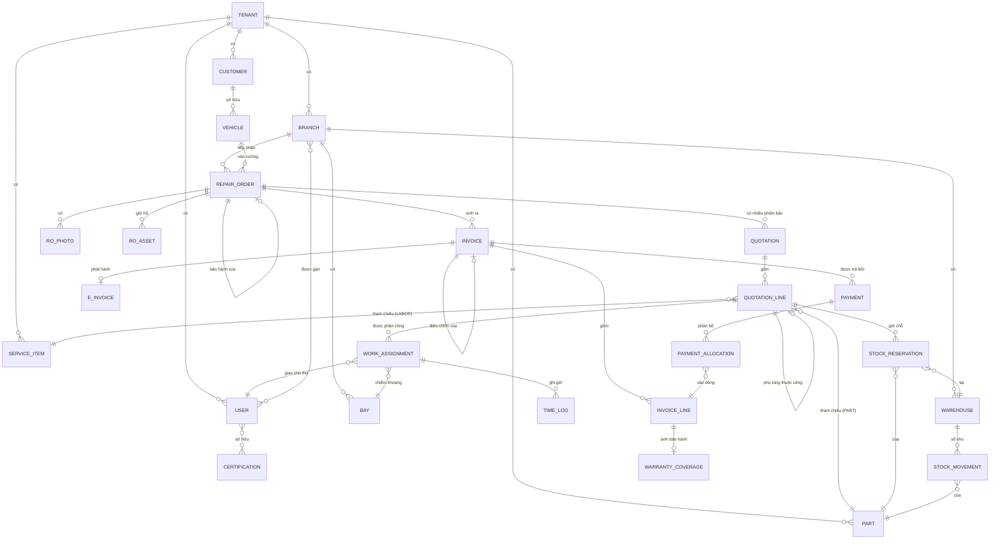

# Mô hình miền (Domain Model)

> Đọc sau: [03-business-process.md](03-business-process.md) · Đọc tiếp: [05-invariants.md](05-invariants.md)
>
> Tài liệu này mô tả **cấu trúc khái niệm**. Schema vật lý (kiểu dữ liệu, index,
> ràng buộc SQL) ở [10-data-model.md](10-data-model.md).

## 1. Phân chia aggregate

Hệ thống chia thành **8 aggregate**. Ranh giới aggregate = ranh giới transaction:
mọi thay đổi bên trong một aggregate là nguyên tử; giữa các aggregate chỉ tham
chiếu qua ID, không qua object.

| # | Aggregate root | Chứa | Vì sao tách riêng |
|---|---|---|---|
| 1 | `Tenant` | `Branch`, `User`, `Certification`, cấu hình | Ranh giới cô lập dữ liệu tuyệt đối |
| 2 | `Customer` | `Vehicle` | Xe không tồn tại độc lập với chủ; đổi chủ là thao tác có kiểm soát |
| 3 | `ServiceCatalog` | `ServiceItem`, `Part`, `PriceList` | Danh mục thay đổi chậm, đọc nhiều ghi ít |
| 4 | **`RepairOrder`** | `Quotation`, `QuotationLine`, `WorkAssignment`, `TimeLog`, ảnh, tài sản | **Aggregate trung tâm.** Mọi quy tắc về duyệt/thi công phải nguyên tử |
| 5 | `StockLedger` | `StockMovement` (chỉ thêm) | Sổ bất biến, ghi rất nhiều, cần tối ưu riêng |
| 6 | `StockReservation` | — | Tách khỏi sổ kho để xử lý tranh chấp đồng thời độc lập |
| 7 | `Invoice` | `InvoiceLine`, `EInvoice` | Bất biến sau khi phát hành — vòng đời độc lập với đơn sửa chữa |
| 8 | `Payment` | `PaymentAllocation` | Một thanh toán có thể liên quan nhiều dòng hoá đơn |

💡 **Vì sao `Invoice` không nằm trong `RepairOrder`:** đơn sửa chữa còn thay đổi
sau khi hoá đơn phát hành (ví dụ bổ sung ảnh bàn giao), nhưng hoá đơn thì không
được phép đổi. Gộp chung sẽ khiến mọi cập nhật đơn đều phải chạm vào bản ghi bất
biến — sai về mặt thiết kế và nguy hiểm về mặt tuân thủ.

💡 **Vì sao `StockReservation` tách khỏi `StockLedger`:** giữ chỗ là thao tác có
tranh chấp cao (nhiều đơn cùng giành một món), cần khoá ở mức dòng phụ tùng. Sổ
kho thì chỉ append, gần như không tranh chấp. Gộp chung sẽ khiến việc append sổ
bị chặn bởi khoá của giữ chỗ.

---

## 2. Sơ đồ quan hệ tổng thể

---

## 3. Chi tiết từng entity

Ký hiệu cột: **PK** khoá chính · **FK** khoá ngoại · **🔒** bất biến sau khi tạo ·
**snap** giá trị snapshot (sao chép tại thời điểm tạo, không tham chiếu động)

### 3.1 Nhóm tổ chức

#### `Tenant`
| Thuộc tính | Kiểu | Ghi chú |
|---|---|---|
| `id` | uuid | PK |
| `name` | text | Tên doanh nghiệp |
| `taxCode` | text | Mã số thuế, dùng cho hoá đơn |
| `discountThresholdPercent` | int | Ngưỡng chiết khấu cần duyệt (mặc định 10) |
| `adjustmentThresholdAmount` | bigint | Ngưỡng giá trị điều chỉnh kho cần duyệt |
| `quotationValidityDays` | int | Hạn hiệu lực báo giá (mặc định 7) |
| `reservationHoldDays` | int | Hạn giữ chỗ phụ tùng (mặc định 7) |
| `invoiceVarianceThresholdPercent` | int | Ngưỡng chênh lệch hoá đơn vs báo giá cần giải trình (mặc định 5) |

#### `Branch`
`id` · `tenantId` FK · `name` · `address` · `phone` · `code` (tiền tố mã đơn)

#### `Bay` — khoang sửa chữa
| Thuộc tính | Kiểu | Ghi chú |
|---|---|---|
| `id` `tenantId` `branchId` | | |
| `name` | text | "Khoang 1", "Cầu nâng A" |
| `capabilities` | text[] | `LIFT`, `EV_CHARGER`, `ALIGNMENT`, `HV_SAFE_ZONE` |
| `isActive` | bool | |

💡 `capabilities` là mảng chứ không phải cột boolean cố định — để thêm loại năng
lực mới (ví dụ khoang chuyên pin) không phải migration.

#### `User`, `Certification`, `UserCertification`
| Entity | Thuộc tính chính |
|---|---|
| `User` | `id` `tenantId` `phone` `email` `passwordHash` `fullName` `roles[]` `isActive` |
| `UserBranch` | `userId` `branchId` — phạm vi chi nhánh |
| `Certification` | `id` `tenantId` `code` (`HV_ELECTRICAL`, `AC_REFRIGERANT`, `ALIGNMENT`) `name` |
| `UserCertification` | `userId` `certificationId` `issuedAt` `expiresAt` |

⚠️ `UserCertification.expiresAt` — chứng chỉ an toàn điện cao áp thực tế có hạn.
Hệ thống phải chặn phân công khi chứng chỉ hết hạn, không chỉ khi thiếu chứng chỉ.

### 3.2 Nhóm khách hàng & phương tiện

#### `Customer`
| Thuộc tính | Kiểu | Ghi chú |
|---|---|---|
| `id` `tenantId` | | |
| `type` | enum | `INDIVIDUAL` \| `COMPANY` |
| `displayName` | text | Tên cá nhân hoặc tên công ty |
| `phone` | text | Liên hệ chung |
| `approverPhone` | text? | 🔧 F-04 — số duy nhất được duyệt báo giá (khách doanh nghiệp tách người duyệt khỏi người liên hệ) |
| `email` `address` | text | |
| `taxCode` | text | Bắt buộc nếu `COMPANY` (xuất hoá đơn) |
| `creditLimitAmount` | bigint | Hạn mức công nợ, 0 = phải trả ngay |
| `paymentTermDays` | int | Số ngày được nợ |

🔒 **Quy tắc thống nhất (F-04):** số nhận OTP duyệt báo giá là
`COALESCE(approverPhone, phone)`. Không có chỗ nào trong hệ thống được dùng
`phone` trực tiếp cho mục đích duyệt.

#### `Vehicle`
| Thuộc tính | Kiểu | Ghi chú |
|---|---|---|
| `id` `tenantId` | | |
| `customerId` | FK | Chủ hiện tại |
| `plateNumber` | text | Định danh nghiệp vụ chính. Duy nhất trong tenant (xem [BC-01](07-business-cases/)) |
| `vin` | text | Có thể null với xe cũ |
| `makeName` `modelName` `year` | text/int | |
| **`powertrain`** | enum | **`ICE` \| `HYBRID` \| `BEV`** — thuộc tính then chốt |
| `batteryCapacityKwh` | numeric | Chỉ với `HYBRID`/`BEV` |
| `color` | text | |
| `lastOdometer` | int | Cập nhật sau mỗi lần bàn giao |
| `lastServiceAt` | timestamptz | Dùng cho nhắc bảo dưỡng |

🔒 `powertrain` quyết định: hạng mục dịch vụ nào hiển thị, chứng chỉ thợ nào cần,
khoang nào phù hợp, chu kỳ bảo dưỡng nào áp dụng. Chi tiết: [BC-11](07-business-cases/).

### 3.3 Nhóm danh mục

#### `ServiceItem` — hạng mục dịch vụ
| Thuộc tính | Kiểu | Ghi chú |
|---|---|---|
| `id` `tenantId` `code` `name` | | |
| `category` | text | `MAINTENANCE`, `REPAIR`, `DIAGNOSIS`, `HV_SYSTEM` |
| `standardHours` | numeric(5,2) | Định mức giờ công |
| `applicablePowertrains` | enum[] | 🔒 Ví dụ `[ICE, HYBRID]` cho "Thay dầu động cơ" |
| `requiredCertifications` | text[] | Ví dụ `[HV_ELECTRICAL]` cho hạng mục pin |
| `defaultParts` | jsonb | Gợi ý phụ tùng đi kèm (partId + qty) |
| `warrantyMonths` | int | Bảo hành công thợ |
| `isActive` | bool | |

#### `Part` — phụ tùng
`id` `tenantId` `sku` `oemNumber` `name` `unit` `category` `warrantyMonths`
`warrantyKilometers` `minStockLevel` `isActive`

#### `PriceList` / `PriceListItem`
| Entity | Thuộc tính |
|---|---|
| `PriceList` | `id` `tenantId` `branchId?` `name` `effectiveFrom` `effectiveTo` `laborRatePerHour` |
| `PriceListItem` | `priceListId` `partId` `sellPrice` `taxRatePercent` |

🔒 Bảng giá **có hiệu lực theo thời gian**, không sửa tại chỗ. Đổi giá = tạo bản
ghi mới với `effectiveFrom` mới. Lý do: báo giá cũ phải tái dựng được.

### 3.4 Aggregate trung tâm — `RepairOrder`

| Thuộc tính | Kiểu | Ghi chú |
|---|---|---|
| `id` `tenantId` `branchId` | | |
| `code` | text | `RO-2026-000123`, duy nhất trong tenant |
| `customerId` `vehicleId` | FK | 🔒 snap — không đổi sau khi tạo |
| `status` | enum | Xem [06-state-machines.md](06-state-machines.md) |
| `customerComplaint` | text | **Nguyên văn lời khách** |
| `odometerIn` | int | 🔒 |
| `odometerOut` | int | Ghi lúc bàn giao |
| `energyLevelIn` | int | % pin (BEV) hoặc vạch xăng quy đổi (ICE) |
| `receivedAt` | timestamptz | 🔒 |
| `promisedAt` | timestamptz | Hẹn trả — cơ sở đo đúng hẹn |
| `deliveredAt` | timestamptz | 🔒 Mốc tính bảo hành |
| `closedAt` `cancelledAt` `cancelReason` | | |
| `customerAccessToken` | text | 🔒 ≥128 bit, cho link tra cứu |
| `warrantyClaimOfRepairOrderId` | FK? | Trỏ về đơn gốc nếu là đơn bảo hành |
| `appointmentId` | FK? | Nếu chuyển từ lịch hẹn |
| `createdByUserId` | FK | |

#### `RepairOrderPhoto`
`id` `repairOrderId` `phase` (`INTAKE`\|`DIAGNOSIS`\|`IN_PROGRESS`\|`AFTER`\|`DELIVERY`)
`storageKey` `caption` `takenByUserId` `takenAt`

🔒 Ảnh `INTAKE` không được xoá — là bằng chứng pháp lý.

#### `RepairOrderAsset` — tài sản khách để trên xe
`id` `repairOrderId` `description` `photoKey?` `returnedAt` `returnedToName`

### 3.5 Báo giá

#### `Quotation`
| Thuộc tính | Kiểu | Ghi chú |
|---|---|---|
| `id` `tenantId` `repairOrderId` | | |
| `seq` | int | 1 = báo giá gốc, ≥2 = bổ sung. Duy nhất theo đơn |
| `status` | enum | `DRAFT` \| `SENT` \| `APPROVED` \| `PARTIALLY_APPROVED` \| `REJECTED` \| `EXPIRED` \| `SUPERSEDED` |
| `laborRatePerHour` | bigint | **snap** từ `PriceList` |
| `subtotalAmount` `discountAmount` `taxAmount` `totalAmount` | bigint | Đơn vị đồng |
| `validUntil` | timestamptz | |
| `sentAt` `respondedAt` | timestamptz | |
| `approvalChannel` | enum | `LINK_OTP` \| `IN_PERSON` \| `PHONE` |
| `approvalEvidence` | jsonb | Mã OTP đã dùng / ảnh chữ ký / ghi âm |
| `approvedByName` | text | Tên người duyệt (khách) |
| `createdByUserId` | FK | |

#### `QuotationLine`
| Thuộc tính | Kiểu | Ghi chú |
|---|---|---|
| `id` `quotationId` `seq` | | |
| `lineType` | enum | `LABOR` \| `PART` |
| `serviceItemId` / `partId` | FK? | Đúng một trong hai, theo `lineType` |
| `parentLineId` | FK? | 🔒 Dòng `PART` trỏ về dòng `LABOR` chứa nó |
| `description` | text | **snap** tên hạng mục/phụ tùng |
| `quantity` | numeric(10,2) | Giờ công (LABOR) hoặc số lượng (PART) |
| `unitPrice` | bigint | **snap** |
| `discountAmount` | bigint | |
| `taxRatePercent` | int | **snap** |
| `lineTotal` | bigint | Tính sẵn, không tính lại lúc đọc |
| **`status`** | enum | **`PENDING` \| `APPROVED` \| `REJECTED`** — quyết định ở cấp dòng |
| `rejectReason` | text? | |
| `isWarranty` | bool | Nếu true → `unitPrice` = 0, chi phí tính nội bộ |

### 3.6 Thi công

#### `WorkAssignment`
| Thuộc tính | Ghi chú |
|---|---|
| `id` `tenantId` `repairOrderId` `quotationLineId` | Chỉ gán cho dòng `LABOR` đã `APPROVED` |
| `technicianId` `bayId` | FK |
| `plannedStart` `plannedEnd` | 🔒 Dùng cho ràng buộc chống trùng |
| `status` | `SCHEDULED` \| `IN_PROGRESS` \| `PAUSED` \| `DONE` \| `QC_PASSED` \| `QC_FAILED` \| `CANCELLED` |
| `qcByUserId` `qcAt` `qcNote` | 🔒 `qcByUserId` ≠ `technicianId` |
| `reworkOfAssignmentId` | FK? | Nếu là làm lại do QC không đạt |

#### `TimeLog`
`id` `workAssignmentId` `technicianId` `startedAt` `endedAt?` `note`
`enteredByUserId` (khác `technicianId` nếu quản lý nhập hộ)

💡 Giờ công **không lưu thành một con số** mà là tổng các đoạn `TimeLog`. Thợ có
thể tạm dừng nhiều lần trong ngày; lưu một con số sẽ mất khả năng kiểm chứng.

### 3.7 Kho

#### `Warehouse`
`id` `tenantId` `branchId` `name` `isDefault`

#### `StockMovement` — sổ kho, **chỉ thêm**
| Thuộc tính | Kiểu | Ghi chú |
|---|---|---|
| `id` `tenantId` `warehouseId` `partId` | | |
| `type` | enum | `RECEIPT` \| `ISSUE` \| `RETURN` \| `TRANSFER_IN` \| `TRANSFER_OUT` \| `ADJUSTMENT` |
| `quantity` | numeric(12,2) | **Có dấu**: nhập dương, xuất âm |
| `unitCost` | bigint | Giá vốn tại thời điểm — cơ sở tính lãi/lỗ |
| `refType` `refId` | text/uuid | Chứng từ nguồn: `REPAIR_ORDER`, `STOCKTAKE`, `TRANSFER` |
| `reason` | text | Bắt buộc với `ADJUSTMENT` |
| `approvedByUserId` | FK? | Với điều chỉnh vượt ngưỡng |
| `createdByUserId` `createdAt` | | 🔒 |

🔒 Không có `UPDATE`, không có `DELETE`. Ghi sai → ghi dòng đảo.

#### `StockReservation`
| Thuộc tính | Ghi chú |
|---|---|
| `id` `tenantId` `warehouseId` `partId` | |
| `repairOrderId` `quotationLineId` | Nguồn giữ chỗ |
| `quantity` | |
| `status` | `ACTIVE` \| `CONSUMED` \| `RELEASED` \| `EXPIRED` |
| `expiresAt` | Theo `tenant.reservationHoldDays` |
| `consumedByMovementId` | FK? — trỏ tới `StockMovement` khi thực xuất |

### 3.8 Tiền

#### `Invoice`
| Thuộc tính | Ghi chú |
|---|---|
| `id` `tenantId` `branchId` `repairOrderId` | |
| `customerId` | 🔧 F-11 — cần cho báo cáo công nợ mà không phải join qua đơn |
| `code` | `INV-2026-000456` |
| `status` | `DRAFT` \| `ISSUED` \| `PARTIALLY_PAID` \| `PAID` \| `ADJUSTED` |
| `customerSnapshot` | jsonb — **snap** tên, MST, địa chỉ tại thời điểm phát hành |
| `subtotalAmount` `discountAmount` `taxAmount` `totalAmount` | bigint |
| `issuedAt` | 🔒 |
| `adjustmentOfInvoiceId` | FK? — nếu là hoá đơn điều chỉnh |
| `adjustmentReason` | text? |
| `dueDate` | Theo `customer.paymentTermDays` |

🔒 Sau `ISSUED`: mọi cột trở thành chỉ đọc.

#### `InvoiceLine`
`id` `invoiceId` `seq` `lineType` `refId` `description`(snap) `quantity`
`unitPrice`(snap) `discountAmount` `taxRatePercent` `lineTotal`
`sourceQuotationLineId?` `sourceWorkAssignmentId?` `isWarranty`

💡 `sourceQuotationLineId` cho phép dựng **bảng đối chiếu báo giá ↔ hoá đơn** —
cơ sở của quy tắc giải trình chênh lệch `BR-09-3`.

#### `Payment` / `PaymentAllocation`
| Entity | Thuộc tính |
|---|---|
| `Payment` | `id` `tenantId` **`customerId`** `payerType` (`CUSTOMER`\|`INSURER`\|`WARRANTY`) `payerName` `amount` `method` (`CASH`\|`TRANSFER`\|`CARD`\|`CREDIT`) `paidAt` `reference` `idempotencyKey` `receivedByUserId` |
| `PaymentAllocation` | `paymentId` `invoiceLineId` `amount` |

💡 Phân bổ tới **từng dòng**, không chỉ tới tổng hoá đơn — bắt buộc để xử lý case
bảo hiểm trả một phần ([BC-08](07-business-cases/BC-08-bao-hiem.md)).

🔧 **F-01 — `Payment` gắn với `Customer`, KHÔNG gắn với `Invoice`.** Một lần
chuyển khoản của khách doanh nghiệp có thể trả cho nhiều hoá đơn cùng lúc
([BC-13](07-business-cases/BC-13-cong-no.md) mục 4.2). Quan hệ tới hoá đơn suy ra
qua `PaymentAllocation → InvoiceLine → Invoice`. Mọi truy vấn công nợ phải đi
theo đường này.

#### `EInvoice`
`id` `invoiceId` `provider` `providerInvoiceNo` `taxAuthorityCode` `status`
(`PENDING`\|`ISSUED`\|`FAILED`\|`CANCELLED`) `requestPayload` `responsePayload`
`issuedAt` `errorMessage`

### 3.9 Bảo hành

#### `WarrantyCoverage`
| Thuộc tính | Ghi chú |
|---|---|
| `id` `tenantId` `invoiceLineId` | Sinh khi bàn giao |
| `coverageType` | `PART` \| `LABOR` |
| `startedAt` | = `repairOrder.deliveredAt` |
| `expiresAt` | Theo tháng |
| `expiresAtOdometer` | Theo km — **hết hạn khi chạm mốc nào trước** |
| `claimedByRepairOrderId` | FK? — đơn bảo hành đã dùng coverage này |

### 3.10 Xuyên suốt

#### `AuditLog`
`id` `tenantId` `actorUserId` `action` `entityType` `entityId` `beforeJson`
`afterJson` `reason` `ipAddress` `userAgent` `createdAt`

🔒 Chỉ thêm. Không API xoá. Quyền DB không cho `DELETE`.

#### `Appointment`
`id` `tenantId` `branchId` `plateNumber` `customerId?` `vehicleId?` `scheduledAt`
`estimatedDurationMinutes` `bayId?` `status` (`BOOKED`\|`CHECKED_IN`\|`NO_SHOW`\|`CANCELLED`)
`convertedToRepairOrderId?` `source` (`ONLINE`\|`PHONE`\|`WALK_IN`)

---

## 4. Các quyết định mô hình hoá đáng chú ý

| # | Quyết định | Phương án bị loại | Lý do chọn |
|---|---|---|---|
| 1 | Trạng thái duyệt ở cấp **`QuotationLine`** | Ở cấp `Quotation` | Khách thường duyệt từng phần; đặt ở cấp báo giá buộc phải lập lại báo giá mỗi lần |
| 2 | Tồn kho **suy ra từ sổ**, không lưu cột `onHand` | Lưu cột và cập nhật | Cột tồn dễ lệch với sổ; suy ra thì luôn khớp. Hiệu năng giải quyết bằng bảng tổng hợp có kiểm chứng |
| 3 | Giá **snapshot** vào dòng | Tham chiếu `PriceList` động | Đổi bảng giá không được làm đổi báo giá đã gửi |
| 4 | Giữ chỗ tách khỏi sổ kho | Trừ thẳng tồn khi duyệt | Trừ thẳng làm sai lệch tồn thực tế; thủ kho nhìn kệ thấy hàng mà hệ thống báo hết |
| 5 | Giờ công là **tập `TimeLog`** | Một cột `actualHours` | Giữ được lịch sử tạm dừng, kiểm chứng được, phát hiện gian lận |
| 6 | `powertrain` trên `Vehicle`, không trên `VehicleModel` | Suy từ model | Xe độ, xe hoán cải tồn tại; và danh mục model không bao giờ đầy đủ |
| 7 | `Invoice` lập từ `WorkAssignment` thực tế | Lập từ `Quotation` | Thực tế luôn lệch báo giá; lập từ báo giá làm sai doanh thu và tồn kho |
| 8 | Đơn bảo hành là một `RepairOrder` mới trỏ về đơn gốc | Thêm cờ vào đơn gốc | Cần theo dõi chi phí riêng và không được sửa chứng từ đơn gốc |

---

## 5. Câu hỏi mô hình hoá còn mở

| # | Vấn đề | Hướng tạm thời |
|---|---|---|
| 1 | Xe đổi chủ — lịch sử sửa chữa thuộc về ai? | ⚠️ Giữ lịch sử theo `Vehicle`, thêm bảng `VehicleOwnership` có thời gian; chủ mới không xem được đơn của chủ cũ |
| 2 | Phụ tùng theo lô/hạn dùng (dầu, ắc quy) | ⚠️ Giai đoạn 2 — thêm `StockBatch`, dùng FIFO |
| 3 | Giá vốn: bình quân gia quyền hay FIFO? | ⚠️ Giai đoạn 1 dùng **bình quân gia quyền động**; ghi rõ trong ADR |
| 4 | Một hạng mục cần **hai thợ cùng làm** | ⚠️ Giai đoạn 1 không hỗ trợ; giai đoạn 2 tách `WorkAssignment` thành nhiều `AssignmentMember` |
| 5 | Xe chuyển giữa chi nhánh giữa chừng | ⚠️ Giai đoạn 2 |
