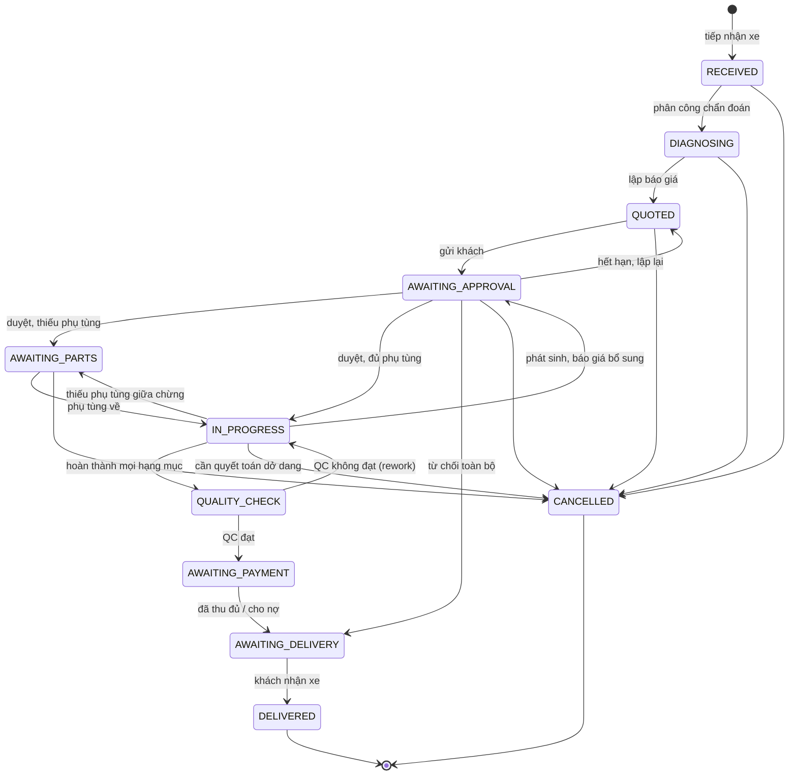
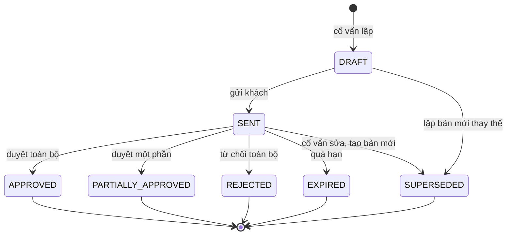
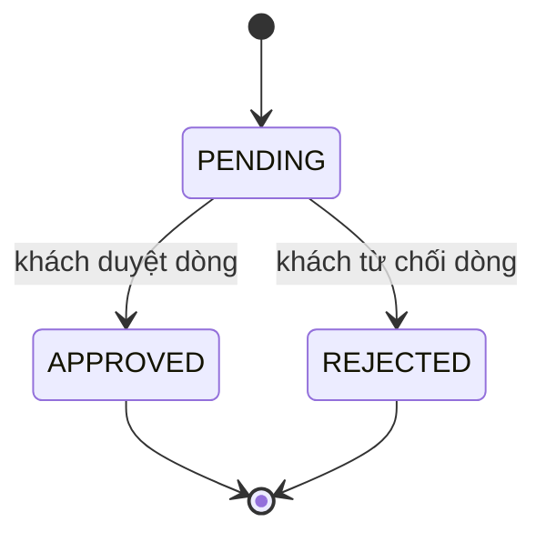
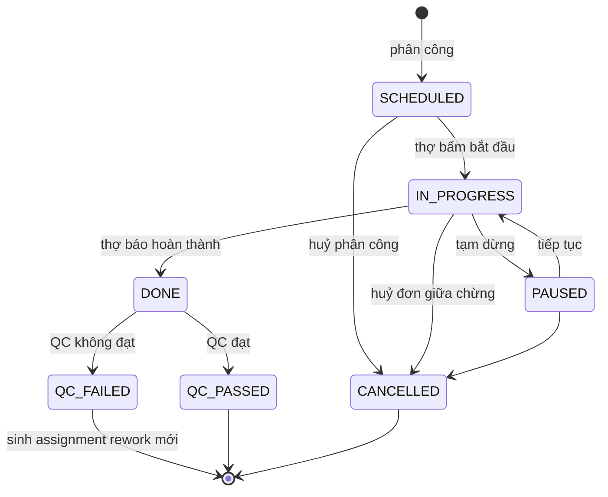
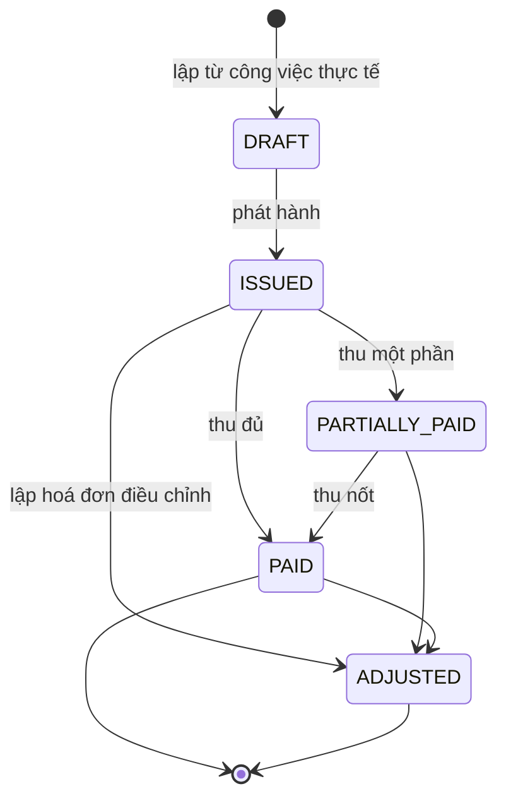
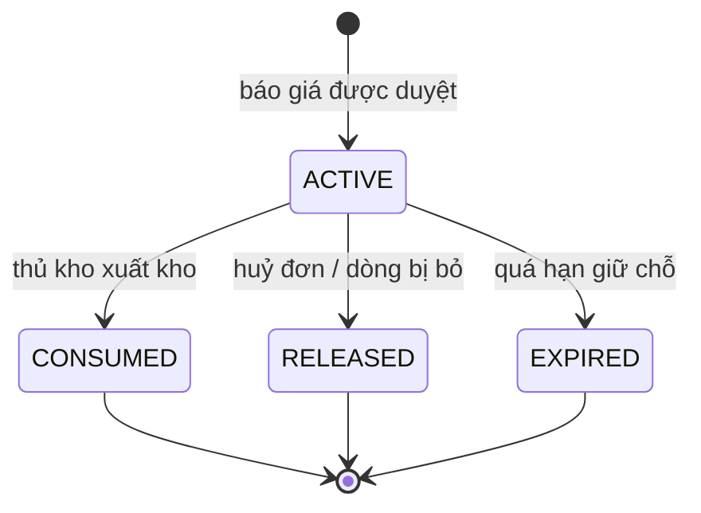
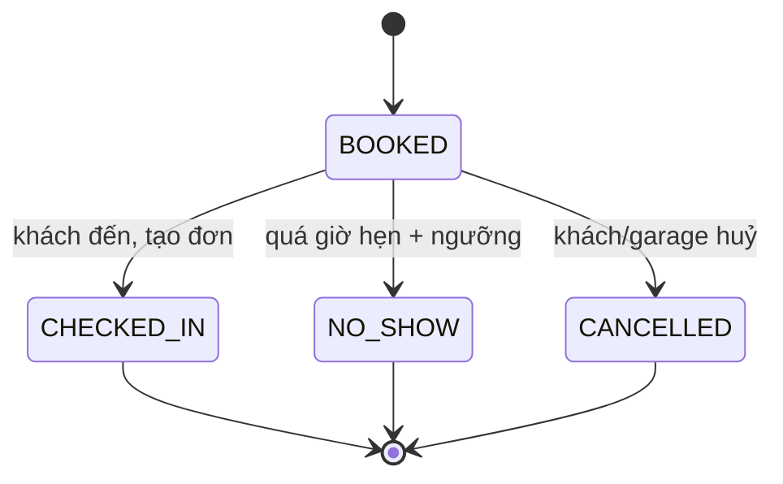

# Máy trạng thái

> Đọc sau: [05-invariants.md](05-invariants.md) · Đọc tiếp: [07-business-cases/](07-business-cases/)

## Nguyên tắc chung

1. 🔒 **Chuyển trạng thái không hợp lệ bị từ chối ở tầng service**, ném lỗi có mã
   rõ ràng (`INVALID_TRANSITION`), không im lặng bỏ qua.
2. 🔒 Mỗi lần chuyển đều ghi `AuditLog` **trong cùng transaction** (`INV-A-02`).
3. Trạng thái được lưu bằng **enum của DB**, không phải chuỗi tự do — thêm trạng
   thái mới bắt buộc phải qua migration, tránh gõ sai âm thầm.
4. Bảng chuyển đổi được khai báo **một chỗ duy nhất** trong `packages/contracts`,
   dùng chung cho backend, web và mobile.

```ts
// packages/contracts/src/state-machines/repair-order.ts
export const REPAIR_ORDER_TRANSITIONS = {
  RECEIVED:           ['DIAGNOSING', 'CANCELLED'],
  DIAGNOSING:         ['QUOTED', 'CANCELLED'],
  QUOTED:             ['AWAITING_APPROVAL', 'CANCELLED'],
  AWAITING_APPROVAL:  ['AWAITING_PARTS', 'IN_PROGRESS', 'AWAITING_DELIVERY', 'QUOTED', 'CANCELLED'],
  AWAITING_PARTS:     ['IN_PROGRESS', 'CANCELLED'],
  IN_PROGRESS:        ['AWAITING_APPROVAL', 'AWAITING_PARTS', 'QUALITY_CHECK', 'CANCELLED'],
  QUALITY_CHECK:      ['IN_PROGRESS', 'AWAITING_PAYMENT'],
  AWAITING_PAYMENT:   ['AWAITING_DELIVERY'],
  AWAITING_DELIVERY:  ['DELIVERED'],
  DELIVERED:          [],
  CANCELLED:          [],
} as const satisfies Record<RepairOrderStatus, readonly RepairOrderStatus[]>;
```

💡 Khai báo chung khiến web/mobile hiển thị đúng nút bấm khả dụng mà không phải
lặp lại logic — và khi thêm trạng thái, TypeScript báo lỗi ở mọi chỗ chưa xử lý.

---

## 1. `RepairOrder` — đơn sửa chữa



### Bảng chuyển đổi chi tiết

| Từ | Đến | Kích hoạt bởi | Tác nhân | Điều kiện (guard) | Hệ quả phụ (side effect) |
|---|---|---|---|---|---|
| — | `RECEIVED` | Tiếp nhận xe | Cố vấn DV | Xe chưa có đơn mở (`INV-V-03`); có ảnh `INTAKE`; có `odometerIn` | Sinh `customerAccessToken`; gửi SMS link; ghi `lastOdometer` |
| `RECEIVED` | `DIAGNOSING` | Phân công chẩn đoán | Quản lý CN | Thợ rảnh và đủ chứng chỉ | Tạo `WorkAssignment` loại chẩn đoán |
| `DIAGNOSING` | `QUOTED` | Lập báo giá | Cố vấn DV | ≥1 hạng mục; mọi hạng mục hợp `powertrain` (`INV-V-01`) | Tạo `Quotation` seq=1 `DRAFT` |
| `QUOTED` | `AWAITING_APPROVAL` | Gửi báo giá | Cố vấn DV | Không có báo giá `SENT` khác (`INV-Q-03`) | `Quotation` → `SENT`; đặt `validUntil`; gửi SMS |
| `AWAITING_APPROVAL` | `IN_PROGRESS` | Khách duyệt | Khách | ≥1 dòng `APPROVED`; giữ chỗ thành công | Tạo `StockReservation`; mở phân công |
| `AWAITING_APPROVAL` | `AWAITING_PARTS` | Khách duyệt | Khách | ≥1 dòng `APPROVED`; **giữ chỗ thất bại** | Đánh dấu món thiếu; báo thủ kho |
| `AWAITING_APPROVAL` | `AWAITING_DELIVERY` | Từ chối toàn bộ | Khách | Mọi dòng `REJECTED` | Lập hoá đơn chỉ gồm công chẩn đoán (nếu có chính sách) |
| `AWAITING_APPROVAL` | `QUOTED` | Báo giá hết hạn | Hệ thống | `now() > validUntil` | `Quotation` → `EXPIRED`; thông báo cố vấn |
| `AWAITING_PARTS` | `IN_PROGRESS` | Phụ tùng về kho | Thủ kho | Mọi dòng `APPROVED` đã giữ chỗ đủ | Tạo `StockReservation` còn thiếu |
| `IN_PROGRESS` | `AWAITING_APPROVAL` | Phát sinh | Thợ → Cố vấn DV | Có hạng mục đề xuất mới | Tạo `Quotation` seq+1; **tạm dừng hạng mục liên quan**, không dừng hạng mục độc lập |
| `IN_PROGRESS` | `QUALITY_CHECK` | Hoàn thành hết | Thợ | Mọi `WorkAssignment` = `DONE` | Tạo yêu cầu QC |
| `QUALITY_CHECK` | `IN_PROGRESS` | QC không đạt | Người QC | Có ghi chú lý do | Tạo `WorkAssignment` rework với `reworkOfAssignmentId`; ⚠️ không tính tiền khách |
| `QUALITY_CHECK` | `AWAITING_PAYMENT` | QC đạt | Người QC | 🔒 Người QC ≠ thợ (`INV-W-04`) | Lập `Invoice` `DRAFT` từ công việc thực tế |
| `AWAITING_PAYMENT` | `AWAITING_DELIVERY` | Thu đủ / cho nợ | Thu ngân | Đã thu đủ **hoặc** khách trong hạn mức công nợ | `Invoice` → `PAID`/`PARTIALLY_PAID`; phát hành HĐĐT |
| `AWAITING_DELIVERY` | `DELIVERED` | Bàn giao | Cố vấn DV | Có `odometerOut`; khách ký; tài sản đã trả | **Kích hoạt `WarrantyCoverage`**; đóng giữ chỗ thừa; cập nhật `Vehicle.lastOdometer` |
| bất kỳ (trừ 2 trạng thái cuối) | `CANCELLED` | Huỷ đơn | Cố vấn DV / Quản lý | Có `cancelReason` | Xem [BC-10](07-business-cases/) — trả phụ tùng, quyết toán phần đã làm |

### Trạng thái cuối

`DELIVERED` và `CANCELLED` là **trạng thái hấp thụ** — không có đường ra. Xe quay
lại vì lỗi cũ tạo **đơn mới** trỏ về đơn cũ qua `warrantyClaimOfRepairOrderId`.

---

## 2. `Quotation` — báo giá



| Từ | Đến | Guard | Hệ quả phụ |
|---|---|---|---|
| `DRAFT` | `SENT` | Có ≥1 dòng; tổng > 0; không có `SENT` khác (`INV-Q-03`) | 🔒 Khoá cứng giá (`INV-Q-05`); đặt `validUntil`; gửi SMS/Zalo |
| `SENT` | `APPROVED` | Mọi dòng `APPROVED`; còn hạn; xác thực OTP | Tạo giữ chỗ; lưu `approvalEvidence` |
| `SENT` | `PARTIALLY_APPROVED` | Có cả dòng `APPROVED` và `REJECTED` | Giữ chỗ **chỉ cho dòng đã duyệt** |
| `SENT` | `REJECTED` | Mọi dòng `REJECTED` | Đơn → `AWAITING_DELIVERY` |
| `SENT` | `EXPIRED` | `now() > validUntil` (job nền) | Thông báo cố vấn |
| `DRAFT`/`SENT` | `SUPERSEDED` | Cố vấn tạo bản seq+1 thay thế | Bản cũ mất hiệu lực; giữ lại để đối chiếu |

⚠️ **`SUPERSEDED` khác `EXPIRED`:** thay thế là do garage chủ động (khách xin
giảm giá), hết hạn là do khách không phản hồi. Tách hai trạng thái để đo được hai
hiện tượng khác nhau trong báo cáo.

---

## 3. `QuotationLine` — dòng báo giá (quyết định duyệt ở đây)



| Quy tắc | Chi tiết |
|---|---|
| 🔒 `INV-Q-02` | Dòng `PART` **kế thừa** trạng thái của dòng `LABOR` cha. Từ chối công → phụ tùng tự động `REJECTED` |
| 🔒 Một chiều | `APPROVED` không quay lại `PENDING`. Đổi ý phải huỷ đơn hoặc lập báo giá mới |
| Ghi nhận | Mỗi lần duyệt lưu: ai, lúc nào, kênh nào, bằng chứng gì (`INV` — xem `BR-04-5`) |

---

## 4. `WorkAssignment` — phân công thi công



| Từ | Đến | Guard | Hệ quả phụ |
|---|---|---|---|
| — | `SCHEDULED` | 🔒 Dòng đã `APPROVED` (`INV-Q-01`); khoang & thợ rảnh (`INV-W-01`, `INV-W-02`); thợ đủ chứng chỉ (`INV-W-03`) | Hiện job card trên app thợ |
| `SCHEDULED` | `IN_PROGRESS` | 🔒 Thợ chưa có việc `IN_PROGRESS` khác (`INV-W-05`) | Mở `TimeLog` |
| `IN_PROGRESS` | `PAUSED` | Có lý do tạm dừng | Đóng `TimeLog` hiện tại |
| `IN_PROGRESS` | `DONE` | Đã xuất đủ phụ tùng cần thiết; có ảnh sau khi làm | Đóng `TimeLog`; tính `actualHours` |
| `DONE` | `QC_PASSED` | 🔒 Người QC ≠ thợ (`INV-W-04`) | Nếu là hạng mục cuối → đơn sang `QUALITY_CHECK` xong |
| `DONE` | `QC_FAILED` | Có ghi chú lý do | Tạo assignment mới `reworkOfAssignmentId`; ⚠️ giờ công rework vào **chi phí nội bộ** |

### Cách tính giờ công

```
actualHours = Σ (TimeLog.endedAt − TimeLog.startedAt)   [chỉ các đoạn đã đóng]
efficiency  = standardHours / actualHours               [>1 = nhanh hơn định mức]
```

🔒 `INV-W-06` bảo đảm các đoạn không chồng nhau, nên phép cộng này luôn đúng.

---

## 5. `Invoice` — hoá đơn



| Từ | Đến | Guard | Hệ quả phụ |
|---|---|---|---|
| — | `DRAFT` | Đơn ở `QUALITY_CHECK` đã đạt | Sinh dòng từ `WorkAssignment` `QC_PASSED` + `StockMovement(ISSUE)` |
| `DRAFT` | `ISSUED` | 🔒 Tổng khớp tổng dòng (`INV-M-02`); chênh lệch vs báo giá ≤ ngưỡng **hoặc** có giải trình | 🔒 **Mọi cột thành chỉ đọc** (`INV-M-03`); gọi adapter HĐĐT; snapshot thông tin khách |
| `ISSUED` | `PARTIALLY_PAID` | `0 < Σ payments < total` | |
| `ISSUED`/`PARTIALLY_PAID` | `PAID` | `Σ payments = total` (`INV-M-04`) | Cho phép bàn giao |
| bất kỳ sau `ISSUED` | `ADJUSTED` | Có `adjustmentReason` | 🔒 Tạo hoá đơn **mới** trỏ về hoá đơn này; hoá đơn cũ **không bị sửa** |

🔒 **Không có đường tới `CANCELLED`.** Hoá đơn đã phát hành không huỷ được — chỉ
điều chỉnh. Đây là ràng buộc bắt buộc để tuân thủ về sau.

---

## 6. `StockReservation` — giữ chỗ phụ tùng



| Từ | Đến | Kích hoạt | Ảnh hưởng tồn kho |
|---|---|---|---|
| — | `ACTIVE` | Dòng `PART` được duyệt | `reserved += qty` · `onHand` **không đổi** |
| `ACTIVE` | `CONSUMED` | Xuất kho thực | `reserved −= qty` · `onHand −= qty` |
| `ACTIVE` | `RELEASED` | Huỷ đơn hoặc bỏ hạng mục | `reserved −= qty` · `onHand` không đổi |
| `ACTIVE` | `EXPIRED` | Job nền, quá `expiresAt` | `reserved −= qty`; cảnh báo cố vấn |

💡 Bảng này là cách trực quan nhất để thấy vì sao phải tách **giữ chỗ** khỏi **tồn
thực tế**: chỉ đúng một chuyển đổi (`CONSUMED`) làm giảm `onHand`.

---

## 7. `Appointment` — lịch hẹn



| Từ | Đến | Guard | Hệ quả phụ |
|---|---|---|---|
| `BOOKED` | `CHECKED_IN` | Khách đến | Tạo `RepairOrder`, gán `appointmentId` |
| `BOOKED` | `NO_SHOW` | `now() > scheduledAt + noShowThreshold` | Giải phóng khoang đã giữ |

---

## 8. Ma trận: trạng thái đơn × hành động cho phép

Bảng này dùng để render đúng nút bấm trên UI **và** để kiểm tra ở service.

| Trạng thái đơn | Sửa tiếp nhận | Lập báo giá | Duyệt báo giá | Phân công | Bấm giờ | Xuất kho | Lập hoá đơn | Bàn giao | Huỷ |
|---|---|---|---|---|---|---|---|---|---|
| `RECEIVED` | ✅ | ❌ | ❌ | 🔶 chẩn đoán | ❌ | ❌ | ❌ | ❌ | ✅ |
| `DIAGNOSING` | ✅ | ✅ | ❌ | 🔶 chẩn đoán | ✅ | ❌ | ❌ | ❌ | ✅ |
| `QUOTED` | ❌ | ✅ | ❌ | ❌ | ❌ | ❌ | ❌ | ❌ | ✅ |
| `AWAITING_APPROVAL` | ❌ | 🔶 bản mới | ✅ | ❌ | ❌ | ❌ | ❌ | ❌ | ✅ |
| `AWAITING_PARTS` | ❌ | ❌ | ❌ | ✅ | ❌ | ❌ | ❌ | ❌ | ✅ |
| `IN_PROGRESS` | ❌ | 🔶 bổ sung | 🔶 bổ sung | ✅ | ✅ | ✅ | ❌ | ❌ | ✅ |
| `QUALITY_CHECK` | ❌ | ❌ | ❌ | 🔶 rework | 🔶 rework | ❌ | ❌ | ❌ | ❌ |
| `AWAITING_PAYMENT` | ❌ | ❌ | ❌ | ❌ | ❌ | ❌ | ✅ | ❌ | ❌ |
| `AWAITING_DELIVERY` | ❌ | ❌ | ❌ | ❌ | ❌ | ❌ | ✅ | ✅ | ❌ |
| `DELIVERED` | ❌ | ❌ | ❌ | ❌ | ❌ | ❌ | ❌ | ❌ | ❌ |
| `CANCELLED` | ❌ | ❌ | ❌ | ❌ | ❌ | ❌ | ❌ | ❌ | ❌ |

---

## 9. Xử lý lỗi chuyển trạng thái

Mọi chuyển đổi sai trả về lỗi có cấu trúc, không phải chuỗi tự do:

```json
{
  "error": {
    "code": "INVALID_STATE_TRANSITION",
    "message": "Không thể bàn giao xe khi đơn đang ở trạng thái đang sửa chữa",
    "details": {
      "entity": "RepairOrder",
      "entityId": "…",
      "currentState": "IN_PROGRESS",
      "attemptedTransition": "DELIVERED",
      "allowedTransitions": ["AWAITING_APPROVAL", "AWAITING_PARTS", "QUALITY_CHECK", "CANCELLED"]
    }
  }
}
```

💡 Trả về `allowedTransitions` giúp client tự sửa và giúp debug nhanh — thay vì
chỉ nói "không được".

Quy ước lỗi đầy đủ: [11-api-design.md](11-api-design.md).
